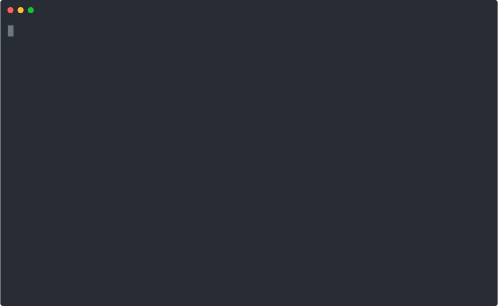
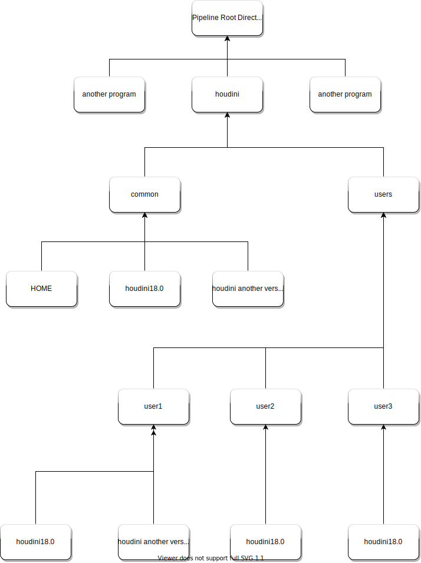

# Houdini Run Render

#### This script starts Houdini and sets common environment variables to run rendering.

- [x] Linux
- [ ] Mac
- [ ] Windows

---



You can conveniently use it by entering the following command in .bashrc or .zshrc.
```shell script
alias hrun="[PATH]/houdini_run_render/HRUN_CTL.sh"
alias h18="hrun --fxuser=[USERNAME] --fxversion=[HOUDINI VERSION]"
```

---

# Directory structure



---
